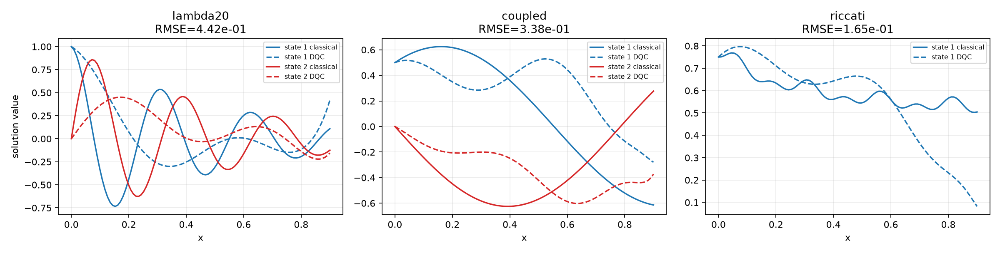

Differentiable quantum-circuit ODE solver
=========================================

The ``pyqpanda_alg.DQC`` module provides a small differentiable quantum-circuit
solver for first-order ordinary differential equations.  It is intended for
local CPU state-vector validation and does not submit cloud or hardware jobs.

The solver represents each solution component with a parameterized circuit
expectation value and enforces the differential equation at collocation points.
An initial-value condition is imposed by the floating construction

.. math::

   \widehat{u}_\theta(x) = u_0 + f_\theta(x) - f_\theta(x_0).

The coordinate derivative uses the parameter-shift rule for the feature
rotations.  The classical reference trajectory is evaluated after optimization
and is not used as a training label.

Three compact benchmarks are included: a damped rotating two-state linear
system, a coupled linear system, and a nonlinear Riccati equation.  The NumPy
state-vector path is the dependency-light default; ``backend="pyqpanda3"``
selects the local QPanda3 CPU state-vector implementation.

Quick start
-----------

.. code-block:: python

   from pyqpanda_alg.DQC import ExperimentConfig, run_experiments

   config = ExperimentConfig(steps=12, collocation_points=24)
   results = run_experiments("all", config=config, backend="numpy")

The runnable example is ``example/QAlgBase/testeg_DQC.py`` and the executable
walkthrough is ``test/12-DQC/demo01-DQC_statevector.ipynb``.

Validation snapshot
-------------------

The checked-in snapshot uses the NumPy state-vector backend, three qubits, two
variational layers, 24 collocation points, and 40 optimizer steps.  Reference
trajectories are evaluated only after training.  The complete machine-readable
record is ``test/12-DQC/results/statevector_validation.json``.

.. list-table:: Validation metrics
   :header-rows: 1

   * - Benchmark
     - Aggregate RMSE
     - Maximum absolute error
     - Holdout residual RMS
   * - Damped rotating mode
     - 4.42e-1
     - 1.12e0
     - 4.06e0
   * - Coupled linear system
     - 3.38e-1
     - 6.58e-1
     - 1.04e0
   * - Nonlinear Riccati equation
     - 1.65e-1
     - 4.22e-1
     - 1.37e0

The implementation is deliberately small: it establishes a reproducible
state-vector baseline and exposes the residual, holdout, and trajectory metrics
needed for later algorithm development.

