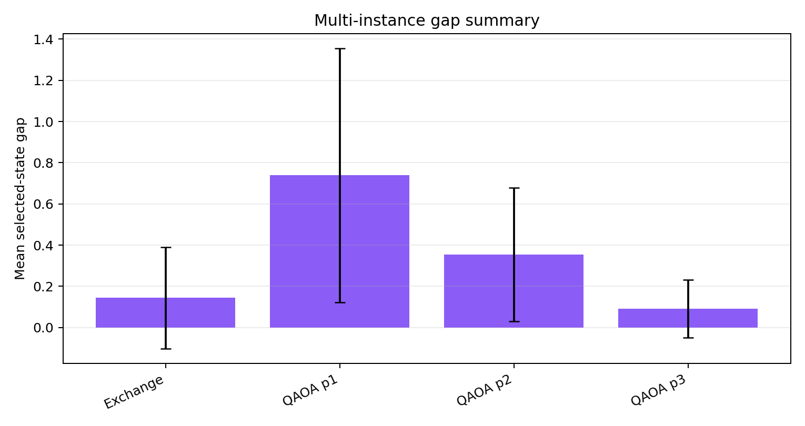
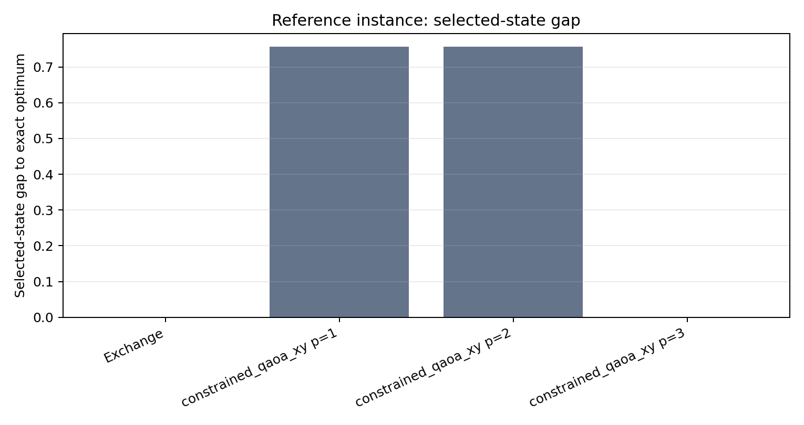

# Constraint-preserving QAOA for QmRMR feature selection

This example extends the repository's QmRMR feature-selection module with a
fixed-cardinality QAOA implementation.  The original `Feature_Selection`
interface remains available; the new facade is exposed as
`pyqpanda_alg.QmRMR.QmRMRFeatureSelection` and can be selected without
changing existing programs.

The implementation targets small, inspectable instances on the pyQPanda3
CPUQVM state-vector simulator.  It reports exact feasibility probabilities,
selected-state and expectation gaps, and comparisons with classical exact,
greedy, and exchange-ansatz baselines.  It does not submit cloud or real-
device jobs.

## Model

Given a symmetric redundancy matrix (Q), a positive relevance vector (r),
and an exact cardinality (k), the canonical QmRMR objective is

```math
f(x)=x^{\mathsf T}Qx-r^{\mathsf T}x,
\qquad x_i\in\{0,1\},
\qquad \sum_{i=1}^{n}x_i=k.
```

The binary-to-Ising map uses (x_i=(1-Z_i)/2):

```math
H_C=c+\sum_i h_i Z_i+\sum_{i<j}J_{ij}Z_iZ_j.
```

The circuit starts from the fixed-weight Dicke state

```math
\lvert D_k^n\rangle={n\choose k}^{-1/2}
\sum_{\lVert x\rVert_1=k}\lvert x\rangle
```

and applies alternating cost phases and the number-preserving mixer

```math
H_M=\frac12\sum_{(i,j)\in E}(X_iX_j+Y_iY_j).
```

The XY exchanges commute with the Hamming-weight operator, so an ideal
state-vector execution stays in the feasible subspace.  The optional
relevance-biased initializer changes amplitudes only inside that subspace.

## Quick start

From a fresh checkout:

```powershell
cd pyqpanda-algorithm
python -m pip install -r requirements.txt
python example\QAlgBase\QmRMR\testeg_QmRMR_constrained.py
```

The compact benchmark driver is:

```powershell
python example\QAlgBase\QmRMR\constrained\run_benchmark.py `
  --run-id expectation_benchmark
```

It writes JSON, CSV and PNG records under the example directory.  The
formula-rich Notebook
`example/QAlgBase/QmRMR/constrained/notebooks/qaoa_qmrmr_workflow.ipynb`
walks through the objective, Ising conversion, circuit construction, API,
feasibility audit and classical comparisons.

The high-level API is:

```python
import numpy as np
from pyqpanda_alg.QmRMR import QmRMRFeatureSelection

rng = np.random.default_rng(42)
relevance = rng.random(6)
quadratic = rng.random((6, 6))
quadratic = 0.5 * (quadratic + quadratic.T)
selector = QmRMRFeatureSelection(
    quadratic,
    relevance,
    select_num=3,
    ansatz="constrained_qaoa",
    layers=3,
    initializer="amplitude",
    optimizer="slsqp",
    maxiter=24,
    restarts=2,
)
result = selector.optimize()
print(result.summary())
```

Use `ansatz="exchange"` for the repository-compatible exchange baseline,
`optimizer="spsa"` for a stochastic optimizer, or
`optimization_objective="cvar"` for the optional lower-tail objective.
`progressive_optimize()` performs deterministic warm starts from depth one to
the requested depth.

## Validation snapshot

The archived expectation benchmark contains six deterministic instances.  On
the canonical reference instance, exact enumeration and the greedy/exchange
references select `011100` with objective `0.837862`.  The depth-three
constraint-preserving QAOA reaches the exact selected state; across all six
instances it reaches the exact state on 4/6 cases (66.7%), with mean selected
gap `0.092468` and minimum feasible probability `1.000000`.  The exchange
baseline also reaches 4/6, while shallow unconstrained-style variants are less
reliable.  These are local state-vector validation records, not a hardware
performance claim.





## Compatibility and limits

The public `QmRMR` package keeps the existing `Feature_Selection` class and
adds the `constrained` subpackage.  The state-vector circuit is intended for
small feature counts; exact enumeration and dense state inspection scale
exponentially.  Sampling noise, cloud execution and real-device calibration
are outside this example.

## References

1. X. Jiang, Z. Chen, J. Zhang, Z. Yu, L. Wang, and H. Mei, “QAOA-based MRMR
   Algorithm for Feature Selection,” *Proceedings of the 2023 International
   Conference on Advances in Artificial Intelligence and Applications*,
   pp. 277–282, 2024. DOI: [10.1145/3603273.3631193](https://doi.org/10.1145/3603273.3631193).
2. S. Hadfield *et al.*, “From the Quantum Approximate Optimization Algorithm
   to a Quantum Alternating Operator Ansatz,” *Algorithms*, 12(2), 2019.
3. P. Barkoutsos *et al.*, “Improving Variational Quantum Optimization using
   CVaR,” *Quantum*, 4, 256, 2020. DOI: [10.22331/q-2020-04-20-256](https://doi.org/10.22331/q-2020-04-20-256).
4. Origin Quantum, [pyqpanda-algorithm](https://github.com/OriginQ/pyqpanda-algorithm).


