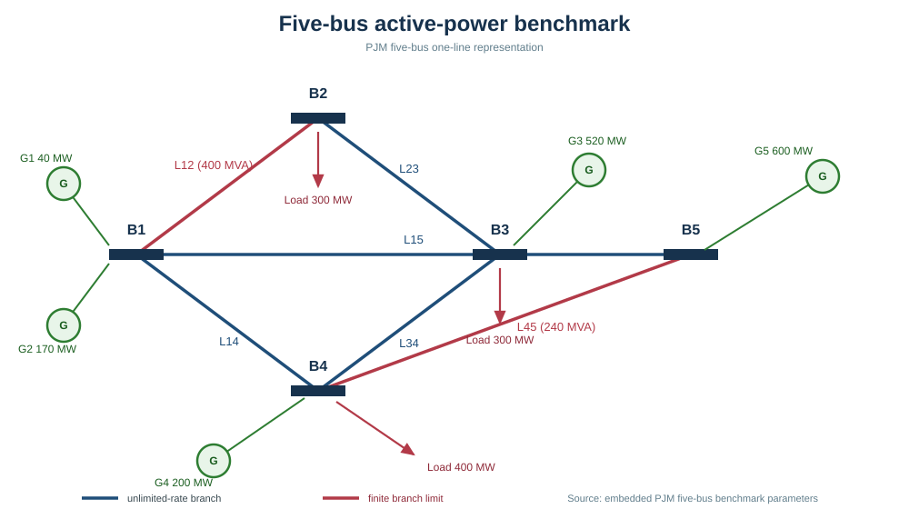
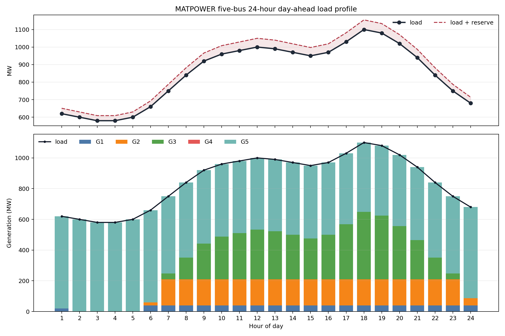
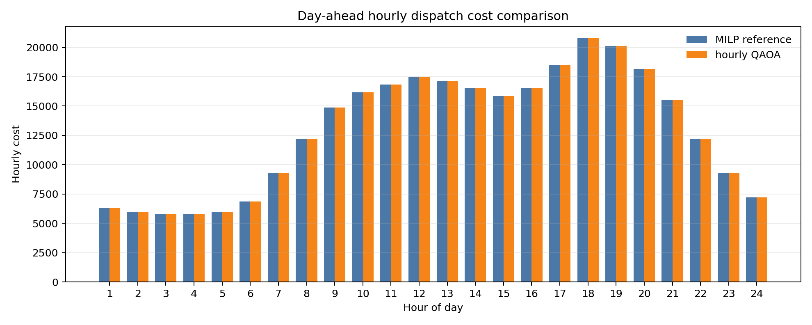

# Day-ahead unit commitment on a PJM five-bus benchmark

This example combines a five-bus power-system model with the QAOA and
classical optimization utilities in `pyqpanda-algorithm`.  The 24-hour
workflow first solves a mixed-integer unit-commitment and economic-dispatch
reference with SciPy, then solves one small commitment QUBO for each hour and
evaluates the resulting schedule with the same dispatch and network checks.
The decomposition keeps every local QAOA circuit at five logical qubits and is
intended for reproducible simulator validation, not a claim of quantum
advantage.

## Model

For generator (g) and hour (t), (u_{g,t}) is a binary on/off decision and
(p_{g,t}) is its output in MW.  The reference minimizes variable, no-load,
and start-up costs:

```math
\begin{aligned}
\min_{u,y,p}\quad &\sum_{t=0}^{23}\left[\sum_g
  (a_g p_{g,t}^{2}+b_g p_{g,t})+F_g u_{g,t}+S_g y_{g,t}\right],\\
\text{subject to}\quad &\sum_g p_{g,t}=D_t,\quad
\sum_g P_g^{\max}u_{g,t}\ge D_t+R_t,\\
&P_g^{\min}u_{g,t}\le p_{g,t}\le P_g^{\max}u_{g,t},\quad
y_{g,t}\ge u_{g,t}-u_{g,t-1}.
\end{aligned}
```

The QUBO contains the five commitment bits for one hour.  Its capacity term is

```math
W\left(\sum_g\frac{P_g^{\max}}{S_{\mathrm{base}}}u_{g,t}
-\frac{D_t+R_t}{S_{\mathrm{base}}}\right)^2,
```

while the continuous dispatch is recovered after the quantum solve.  The
embedded PJM benchmark data include bus loads, generator limits and costs,
branch reactances, and line limits.  No MATLAB or external MATPOWER runtime is
needed.

## Quick start

From a fresh checkout, install the package dependencies and run the complete
24-hour study:

```powershell
cd pyqpanda-algorithm
python -m pip install -r requirements.txt
python example\QAlgBase\UnitCommitment\run_day_ahead.py
```

The script writes a JSON schedule and two figures next to this README under
`results/day_ahead/`.  The notebook
`notebooks/case5_day_ahead_workflow.ipynb` presents the equations, model
construction, classical reference, QAOA comparison, and interpretation in
separate executable sections.

The package facade is also importable directly:

```python
from pyqpanda_alg.UnitCommitment import (
    load_case5_day_ahead,
    solve_milp_uc,
    solve_hourly_qaoa,
)

instance = load_case5_day_ahead(reserve_fraction=0.05)
reference = solve_milp_uc(instance, evaluate_method="linprog", enforce_network=True)
quantum = solve_hourly_qaoa(instance, backend="statevector", maxiter=4, seed=11)
print(reference.schedule.total_cost, quantum.schedule.total_cost)
```

## Recorded validation

The checked-in local record uses a 5% spinning-reserve requirement and the
default reproducible load curve (overnight valley, morning ramp, daytime
plateau, evening peak, and late-evening decline).  The reference schedule has
a total cost of approximately `311445.95` cost units.  The hourly state-vector
QAOA comparison has a total cost of approximately `311504.11`, corresponding
to a relative gap of `0.0187%`.  The accompanying finite-shot noisy record is
kept separately and reports the measured schedule, feasibility checks, and
noise configuration.  These values are simulator records for the stated
seeds and optimizer settings.







## Optional Runtime FakeBackend path

The optional `run_fakebackend.py` script exercises the OriginQ Runtime
FakeBackend transport locally.  It reads a caller-owned key only from the
environment variable named by `--api-key-env`; the key value is never printed,
stored, or committed.  No real-device task is submitted by this example.

```powershell
$env:QPANDA3_API_KEY = "<your-OriginQ-api-key>"
python example\QAlgBase\UnitCommitment\run_fakebackend.py `
  --hardware-name WK_C180 --shots 256 --maxiter 4
```

The placeholder is intentionally not a credential.  The result record stores
only the variable name and a boolean indicating whether the process could see
it.  The optional `qpanda3_runtime` package must be installed separately.

## Validation command

```powershell
cd pyqpanda-algorithm
python -m pytest -q test\UnitCommitment
```

The tests check the classical 24-hour reference, QUBO consistency and the
QPanda3 Pauli-term compatibility adapter.  The code is designed for small
instances and local CPU state-vector execution; line-flow and dispatch
feasibility remain classical post-processing checks.

## References

1. F. Li and R. Bo, “DCOPF-based LMP simulation: Algorithm, implementation and
   example,” IEEE PES General Meeting, 2010.
2. E. Farhi, J. Goldstone, and S. Gutmann, “A Quantum Approximate Optimization
   Algorithm,” arXiv:1411.4028, 2014.
3. L. Zhou *et al.*, “Quantum Approximate Optimization Algorithm:
   Performance, Mechanism, and Implementation on Near-Term Devices,”
   *Physical Review X*, 10, 021067, 2020.
4. Origin Quantum, [QPanda3 documentation](https://github.com/OriginQ/QPanda3-doc).


